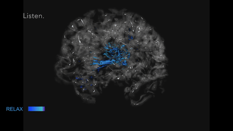
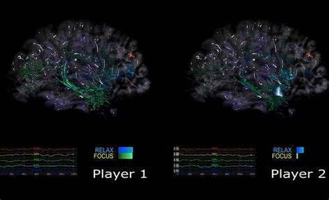

# Synapsody

An interactive experience that lets participants see their own brain activity in real time while interacting with music — watch your synapses fire as you learn to control your brainwaves and explore your innate creativity.

Synapsody is a **1-2 player music game**. Each player wears an EEG headset; consciously relaxing or focusing changes the music in real time and is illuminated live on a 3D brain sculpture/visualization.

Intro video (compressed): [media/Synapsody_Intro_compressed.mp4](media/Synapsody_Intro_compressed.mp4)

## Technology

- EEG headset for real-time brainwave capture
- [Petal Metrics](https://petalmetrics.com/) — bridges Muse EEG data over Bluetooth into OSC
- [TouchDesigner](https://derivative.ca/) — real-time EEG-to-OSC pipeline, visualization, and show control
- [KalmanJS](https://github.com/wouterbulten/kalmanjs) — signal filtering for EEG data
- 3D brain model with real-time synaptic mapping driven by live EEG signal
- Original interactive, nonlinear music composition mapped to brainwave data (relax/focus)

## Credits

- **Elle Spencer Lewis** — interactive design, TouchDesigner programming, audio-reactive signal architecture, music composition, EEG data acquisition and filtering
- **Jeff Smith** — visual design and TouchDesigner programming

## Related

- [pixeldriver/](pixeldriver/) — a prototype exploring a physical exhibit counterpart, mapping live EEG data to an LED bank propagated through fiber-optic cable and 3D-printed synapse structures.
- [two-player/](two-player/) — an iteration built around simultaneous two-player interaction.

## Status

Synapsody has gone through multiple research iterations, including work conducted through an ASU-affiliated research collaboration. This project is under active development and being evaluated for IP protection, so production source files and implementation-level detail are not published in this repository.

## Requirements

- [TouchDesigner](https://derivative.ca/) (macOS)
