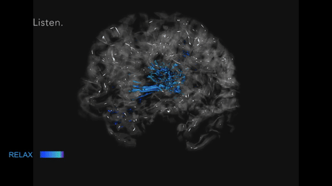
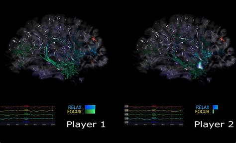

# Synapsody

An interactive music experience for exploring your own brain activity. Participants wear an EEG headset, and relaxing or focusing changes the music in real time while a 3D brain visualization responds.

Synapsody is a **1-2 player music game** built in TouchDesigner.

## Credits

- **Elle Spencer Lewis**: interactive design, TouchDesigner programming, music composition
- **Jeff Smith** (CEO of Eye Vapor): developed the original brain visualization, visual design, and the EEG hookup in TouchDesigner, originally for a separate project with a Grateful Dead drummer, advised by Dr. Adam Gazzaley (UCSF). Jeff shared that TouchDesigner work with Elle, who adapted it for Synapsody.

## Related

- [pixeldriver/](pixeldriver/): a prototype exploring a physical exhibit counterpart
- [two-player/](two-player/): an iteration built around simultaneous two-player interaction
- [brain-display/](brain-display/): the core 3D brain visualization component

## Status

Under active development, with earlier iterations developed through an ASU-affiliated research collaboration. Production source files are not published in this repository.

## Requirements

- [TouchDesigner](https://derivative.ca/) (macOS)
