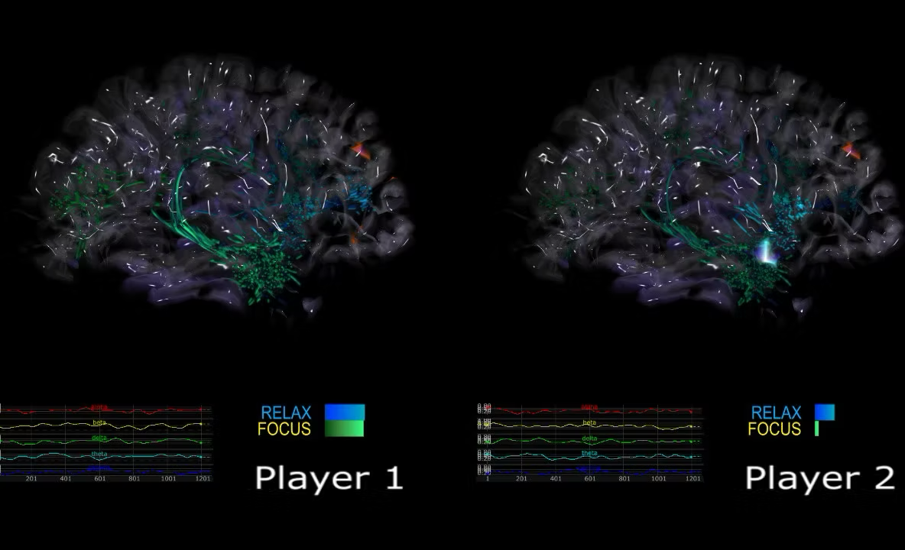

# Synapsody — Two-Player Iteration

An iteration of [Synapsody](../) built around simultaneous two-player interaction — each participant's EEG signal drives their own brain visualization side by side, so players can compare and interact with each other's brain activity in real time as they play the music game together.

## Status

Like the main Synapsody project, this is part of ongoing research being evaluated for IP protection, so implementation details are not published in this repository.
